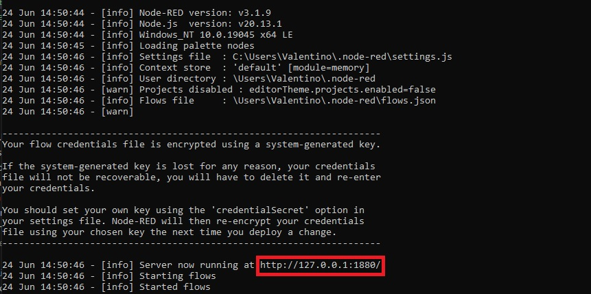

Para ejecutar esta API es necesario haber instalado previamente el paquete de Node.js 

## Ejecutar Node-red
para ejecutar Node-red tendremos que dirijirnos al cmd (ejecutarlo como administrador) para luego escribir el comando `Node-red`

La direccion ip que nos sale la copiaremos y pegaremos en google donde podremos importar el archivo `flows (3)` o copiar y pegar el contenido del archivo `script del node-red`

Ademas es probable que no funcione la base de datos porque tiene que ser creada previamente (revisar el directorio `BDSQL` ) y ademas tenemos que cambiarle el `host`, `el puerto` y en caso de que hayamos creado poner el usuario y constraseña