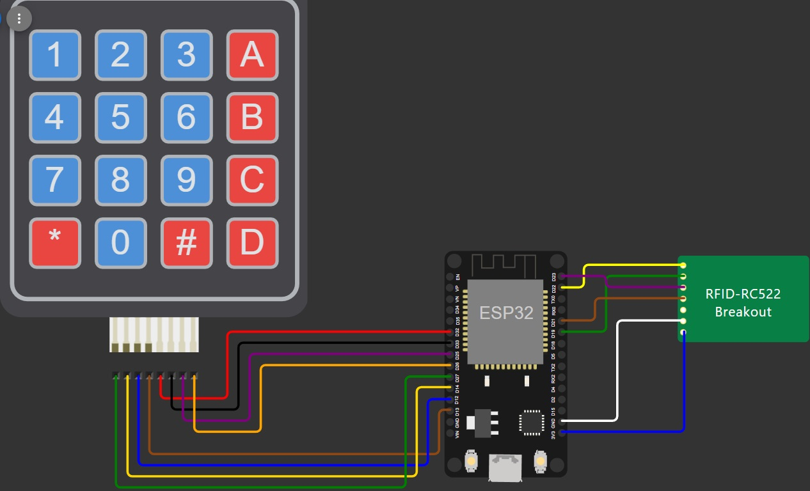
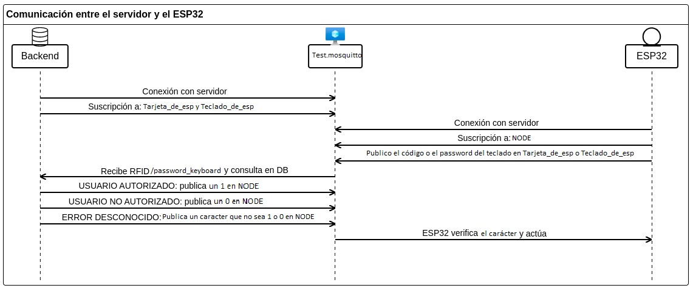
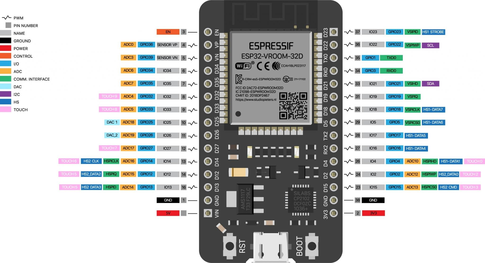
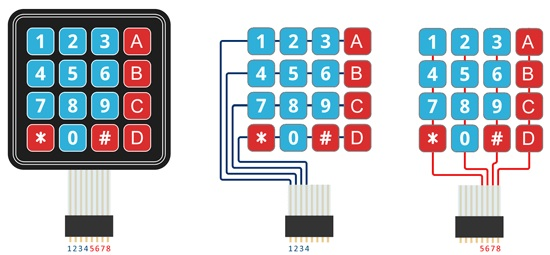

### Proyecto para la carrera de sistemas embebidos e IOT del IFTS14


Este proyecto se divide en 3 partes: 
-  La base de datos relacional (SQL)
- La API para conectar la BD con el ESP32 a traves de un servidor MQTT
- Una carpeta main en la que se encuentra el codeo en lenguaje C que utiliza el ESP32

## Documentacion [Linkdelcoso](./documentacion/html/index.html)

### Imagenes

## Diagrama del circuito hecho en wokwi:



## Diagrama del funcionamiento del dispositivo:



## Diagrama del pinout que tiene el esp utilizado el cual fue sacado de stareware



Revisar que su placa de desarrollo coincida con el siguiene pinout

#### Link para comprar el ESP32 [Linkdelcoso](https://tienda.starware.com.ar/producto/placa-desarrollo-espressif-esp32-ch9102x-dual-core-wifi-bluetooth/ "Link") 


## Funcionamiento de los pines del teclado


### Videos

## Funcionamiento del producto cuando se lee una tarjeta aceptada

https://github.com/Valen989/Proyecto-terciario/assets/168491945/be562d63-bfd8-4a42-9cbe-761d0a99b043

## Funcionamiento del producto cuando se lee una tarjeta rechazada

https://github.com/Valen989/Proyecto-terciario/assets/168491945/24c13f65-53d7-45f8-bf5b-b040626c9e7b

## Funcionamiento del producto cuando se lee una password aceptada

https://github.com/Valen989/Proyecto-terciario/assets/168491945/0f934803-fe3b-4010-b8cb-a2c4d3ee81db

## Funcionamiento del producto cuando se lee una password rechazada

https://github.com/Valen989/Proyecto-terciario/assets/168491945/0d3bb047-016f-45b9-a058-f216081749bd

## Configuracion

### Pines GPIO para la conexion entre el ESP y el lector RFID

GPIO(ESP32)  | Pines Lector RFID
------------- | -------------
SDA_GPIO   |  22
SCK_GPIO   |  19
MOSI_GPIO  |  23
MISO_GPIO  |  21

### Pines GPIO para la conexion entre el ESP y el teclado matricial

GPIO(ESP32)  | Pines Teclado Matricial
-------------| -------------
Columna_1  |  32
Columna_2  |  33 
Columna_3  |  25
Columna_4  |  26
Fila_1     |  27
Fila_2     |  14
Fila_3     |  12
Fila_4     |  13


## MQTT

URL del broker MQTT: `mqtt://test.mosquitto.org`

### Topicos en los que se envia informacion:

`/Tarjeta_de_esp`    Por este topico se envian los ID de las tarjetas

`/Teclado_de_esp`    Por este topico se envian las passwords escritas en el teclado

### Topico al que el ESP esta suscripto

`RES/NODE`        Por este topico se recibe el 1 o 0 que va a procesar el ESP

## Configuracion WIFI

Para iniciar la conexion WIFI debera crearse un archivo.h llamado "wifi_credentials.h" en el que se ingresara la red y contraseña wifi a la que se busca conectar el ESP

```c
#ifndef _WIFI_CREDENTIALS_H
#define _WIFI_CREDENTIALS_H

#define WIFI_CREDENTIALS_ID       ("Tu red")
#define WIFI_CREDENTIALS_PASS     ("Tu contraseña")

#endif
```

## Procesamiento de respuestas

Para el procesamiento de respuestas se utilizo un bucle for el cual lee la informacion que le llega desde el topico (en este caso RES/NODE) y lo mete en una variable i luego verifica si esa variable es igual a 1 (prende el led e imprime Usuario autorizado), igual a 0 (apaga el led e imprime Usuario no autorizado) o es otro carácter (imprime Error inesperado)

```c
void get_data(char* data, char* topic) {
    for (int i = 0; data[i] != '\0'; i++) {
        if (data[i] == '1') {
            CHECK(topic, RES_NODE, action_ok);
        } else if (data[i] == '0') {
            CHECK(topic, RES_NODE, action_fail);
        } else {
            CHECK(topic, RES_NODE, action_unknown);
        }
    }
}
```

Para ver mas en detalle la API o la base de datos entrar en el directorio `NODE-RED` para el primero o `BDSQL` para la segunda